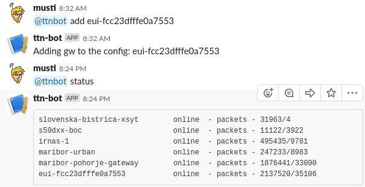

# ttn-gw-slack-notification
Very simple and crude bot for monitoring TheThingsNetwork gateways via Slack channel integration. The list of features is minimal:
 * responds to commands when directly mentioned @ttnbot (or similar as you configure)
   * `status` - replies with stauts of all gateways
   * `add` - adds a gateway
   * `remove` - removes the gateway
 * Send automated message when gateways going online and offline 

Theory of operation is rather simple. There is a file `config.yml` consisting of Slack credentials and a list of gateways to be monitored. 



## Setup
Download this repository. Set up the environment, recommended to use python virtual environment `pip install virtualenv`.

```
git clone https://github.com/SloMusti/ttn-gw-slack-notification
cd ttn-signal-test-python
python3 -m venv ./env
source env/bin/activate
pip install -r requirements.txt
```

## Slack config
To add the bot in slack and get the key, follow these instructions: https://www.fullstackpython.com/blog/build-first-slack-bot-python.html Then also create the channel as you see fit and enter the name in the config.


## Prepare config
Create the config file `config.yml` with the following structure, you can have multiple gateways listed and Slack credentials are required.
```
gw:
- <your_gw_1>
- <your_gw_2>

slack:
  channel: <your channel>
  token: <xoxb-slack-key>
```

## Run the application
Run the application within the active virtual environment with `python main.py` or if running on the server or rpi and wanting to run in background `nohup python main.py &`. A simple option is to run tios on AWS EC2 instance with Ubuntu or similar.

Sample status output:
```
irnas-1                        online  - packets - 18/2
maribor-urban                  online  - packets - 1/0
```
